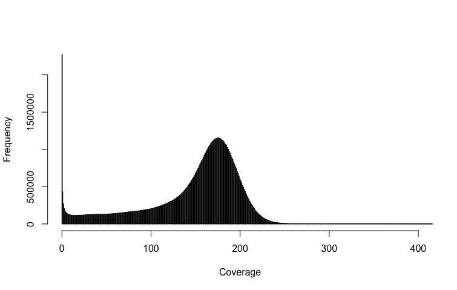
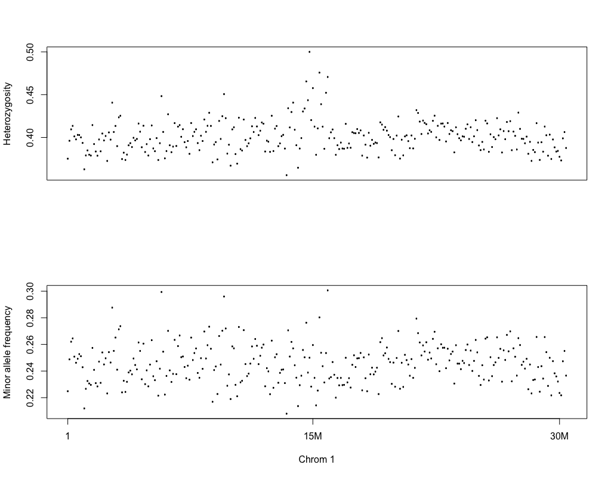

[](http://www.gnu.org/licenses/gpl-3.0)

# MAPGD for plants

## A simple workflow for population analysis using MAPGD. For software download and the complete manual, please visit the [MAPGD](https://github.com/LynchLab/MAPGD) page.

## Installation

- __Running environment__: 
    - The workflow was constructed based on the __Linux system__.

- __Required software and versions__: 
    - [SAMtools v1.9](http://www.htslib.org/)
    - [MAPGD v0.4.40](https://github.com/LynchLab/MAPGD) 
    - [R v4.1.3](https://www.r-project.org/) for visualization

## Input Data

The example data used here was downloaded from the *Arabidopsis* 1001 Genomes Project [JGIHeazlewood2011](https://1001genomes.org/projects/JGIHeazlewood2011/index.html).

## Submit the job to HPC cluster

```
sbatch workflow/mapgd_pipe.sh
```

## Basic steps

- Sort bam files and [filter](https://broadinstitute.github.io/picard/explain-flags.html) for mapped reads.
- Get header file.
- Generate mpileup file.
- Make a pro file of nucleotide-read quartets (counts of A, C, G, and T) from the mpileup file.
- Run the allele command to estimate allele and genotype frequencies from the pro file.
- Determine the minimum and maximum population-coverage cut-off values by making a histogram of the population coverage.

- Run the filter command to filter the map file of ML estimates of the parameters.
- Run the genotype command to generate a file of genotype likelihoods.
- Randomly subsample a group of SNPs.
- Run the relatedness command.

## Expected results

Average heterozygosity and minor allele frequency across every 100kb window on each chromosome.


## License
[MAPGD](https://github.com/LynchLab/MAPGD) is a free and open source software, licensed under [GPLv3](https://github.com/github/choosealicense.com/blob/gh-pages/_licenses/gpl-3.0.txt).
